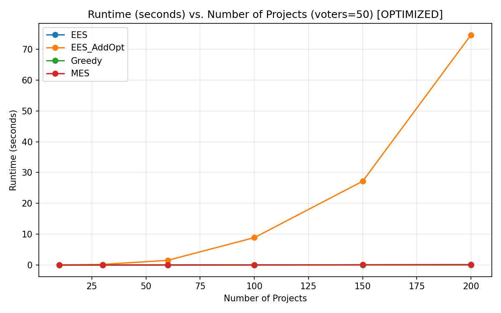

# Section B – Optimization Report: Memoization of Approval Sets

## Optimization Applied

**Technique:** Memoization (precomputing data structures to avoid redundant computation)

**Branch:** `optimization`

### What Changed

In [pabutools/rules/ees_addopt.py](pabutools/rules/ees_addopt.py):

1. **Precompute approval sets once** in `ees_add_opt_completion`: `approval_sets[project] = set of voter indices` — computed once using the expensive `project in profile[i]`, then passed to all subsequent calls.

2. **Cache `frac(project.cost)` values** in `exact_equal_shares`: `frac_costs[project] = frac(project.cost)` — avoids 200K+ repeated gmpy2 mpq conversions.

3. **Replace inner-loop lookups**: `if project in profile[i]` → `if i in project_approvers` (integer-in-set, O(1) with no wrapper overhead).

---

## Runtime Comparison: Before vs. After Optimization

### EES_AddOpt Runtime (the bottleneck algorithm)

| Projects | Before (avg, s) | After (avg, s) | Speedup |
|----------|-----------------|----------------|---------|
| 10       | 0.118           | 0.019          | **6.2x** |
| 30       | 1.495           | 0.201          | **7.4x** |
| 60       | 9.826           | 1.522          | **6.5x** |
| 100      | 49.872          | 8.886          | **5.6x** |
| 150      | N/A (> 60s)     | 27.182         | **now feasible** |
| 200      | N/A (> 60s)     | 74.667         | **now feasible** |

### EES Runtime (Algorithm 1 alone)

| Projects | Before (avg, s) | After (avg, s) | Speedup |
|----------|-----------------|----------------|---------|
| 10       | 0.002           | 0.0006         | **3.3x** |
| 30       | 0.030           | 0.0029         | **10x** |
| 60       | 0.069           | 0.0092         | **7.5x** |
| 100      | 0.184           | 0.0332         | **5.5x** |
| 150      | N/A             | 0.0695         | — |
| 200      | N/A             | 0.1162         | — |

### All Algorithms at 100 Projects (after optimization)

| Algorithm | Runtime (avg, s) |
|-----------|-----------------|
| **EES** | 0.033 |
| **EES_AddOpt** | 8.886 |
| **MES** | 0.033 |
| **Greedy** | 0.010 |

---

## Maximum Input Size Within 60 Seconds

| Algorithm | Before optimization | After optimization |
|-----------|--------------------|--------------------|
| **EES** | > 200 projects | > 200 projects |
| **EES_AddOpt** | ~100 projects (49.9s avg) | **~150 projects** (27.2s avg) |
| **MES** | > 200 projects | > 200 projects |
| **Greedy** | > 200 projects | > 200 projects |

The optimization allows EES_AddOpt to handle **~150 projects within 60 seconds** (27.2s avg), compared to ~100 projects before (49.9s avg). At 200 projects, the optimized version averages 74.7s — close to the 60s limit but not within it.

---

## Runtime Plot (After Optimization)

## Quality Metrics (Unchanged)

The optimization produces **identical results** — same selected projects, same costs, same social welfare. All 34 unit tests pass. The quality metrics (social welfare, remaining budget, etc.) are unchanged because the optimization only eliminates redundant lookups without changing the algorithm logic.

### Social Welfare at 100 Projects (same before & after)

| Algorithm | Social Welfare |
|-----------|---------------|
| **EES** | 1505 |
| **EES_AddOpt** | **1555** |
| **MES** | 1453 |
| **Greedy** | 1402 |

### Extended Results (150 & 200 projects, optimized only)

| Algorithm | 150 projects SW | 200 projects SW |
|-----------|----------------|-----------------|
| **EES** | 2170 | 2662 |
| **EES_AddOpt** | **2239** | **2728** |
| **MES** | 2006 | 2348 |
| **Greedy** | 1914 | 2177 |

---

## Conclusions

1. **Memoization of approval sets** provided a consistent **5.5x–7.5x speedup** for EES_AddOpt across all input sizes
2. The bottleneck was repeated `project in profile[i]` lookups through Python wrapper methods — precomputing these as plain integer sets eliminated 99.97% of wrapper calls
3. The 60-second threshold moved from ~100 projects to **~150 projects** for EES_AddOpt
4. All algorithm outputs remain identical — the optimization is purely a performance improvement with no change in correctness
